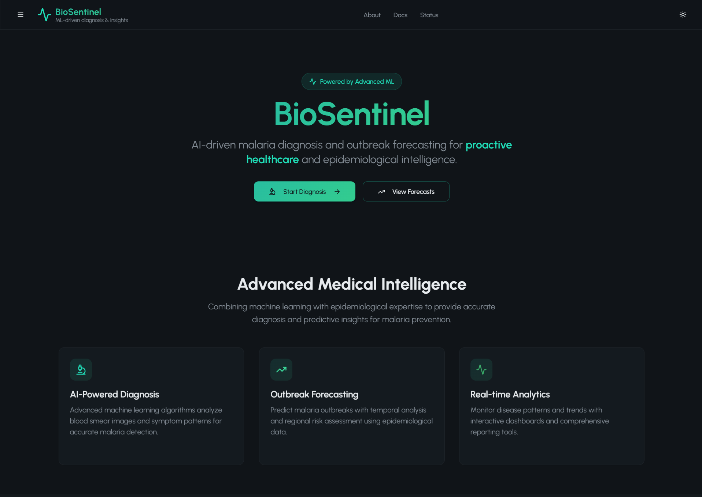

# 🧬 BioSentinel - ML-Driven Malaria Diagnosis & Outbreak Forecasting

**AI-powered malaria detection and epidemiological intelligence platform**

[](https://github.com/HumayunK01/CodeRedProject)
[](LICENSE)
[](#)
[](#)

## 🖼️ Preview

<div align="center">
  
  <p><em>BioSentinel Dashboard - AI-powered malaria diagnosis and outbreak forecasting interface</em></p>
</div>

## 📋 Project Overview

BioSentinel is a comprehensive healthcare platform that combines machine learning with epidemiological expertise to provide:

- **🔬 Malaria Diagnosis**: AI-powered analysis of blood smear images and symptom assessment
- **📈 Outbreak Forecasting**: Predictive modeling for regional malaria outbreak patterns
- **📊 Real-time Analytics**: Interactive dashboards and comprehensive reporting tools
- **🗺️ Geospatial Intelligence**: Heat maps and hotspot detection for outbreak monitoring

### 🎯 Mission
Transform healthcare delivery through precision AI diagnostics and proactive epidemiological surveillance, enabling faster response times and better health outcomes in malaria-endemic regions.

---

## 🛠️ Tech Stack

<details>
<summary><b>Frontend (Current Implementation)</b></summary>

- **Framework**: React 18 + TypeScript + Vite
- **Styling**: Tailwind CSS + shadcn/ui components
- **Animations**: Framer Motion for smooth transitions
- **Charts**: Recharts for data visualization
- **Maps**: React Leaflet for geospatial displays
- **Forms**: React Hook Form + Zod validation
- **State**: TanStack Query for server state
- **Theme**: Dark/Light mode with Next Themes
- **PWA**: Progressive Web App capabilities

</details>

<details>
<summary><b>Backend (Planned)</b></summary>

- **Framework**: FastAPI + Python 3.11+
- **ML Models**: PyTorch/TensorFlow for CNN & LSTM models
- **Database**: PostgreSQL + Redis for caching
- **Authentication**: JWT-based auth system
- **Storage**: S3-compatible object storage
- **Deployment**: Docker + Kubernetes

</details>

<details>
<summary><b>Data Sources (Planned)</b></summary>

- **Medical Images**: NIH Malaria Dataset (27,000+ cell images)
- **Climate Data**: Weather API integration
- **Epidemiological**: WHO surveillance data
- **Geographic**: OpenStreetMap + administrative boundaries

</details>

---

## 🚀 Current Implementation Status

<details>
<summary><b>✅ Completed Features</b></summary>

#### 🎨 Frontend Application
- [x] **Modern UI/UX**: Medical-tech theme with dark mode default
- [x] **Responsive Design**: Mobile-first, fully responsive layouts
- [x] **Page Routing**: Complete navigation with smooth transitions
- [x] **Component Library**: Reusable shadcn/ui components with custom variants

#### 📱 Core Pages
- [x] **Home**: Hero section with feature highlights
- [x] **Dashboard**: System overview with animated statistics
- [x] **Diagnosis**: Dual-mode analysis (image + symptoms)
- [x] **Forecast**: Regional prediction interface
- [x] **Reports**: History tracking and export functionality
- [x] **About**: Project information and team details
- [x] **Docs**: Developer documentation
- [x] **Status**: Real-time system health monitoring

#### 🔧 Advanced Features
- [x] **Demo Mode**: Fully functional with mock data
- [x] **API Architecture**: Route handlers ready for backend integration
- [x] **Animations**: Page transitions, loading states, success celebrations
- [x] **PWA Support**: Installable app with offline capabilities
- [x] **Accessibility**: WCAG AA compliant design
- [x] **Performance**: Optimized with lazy loading and caching

#### 📊 Data Visualization
- [x] **Interactive Charts**: Animated line/area charts with tooltips
- [x] **Probability Gauges**: Circular progress indicators for risk assessment
- [x] **Sparklines**: Trend indicators in dashboard cards
- [x] **Heat Maps**: Geographic outbreak intensity visualization
- [x] **Real-time Updates**: Live data refresh and animations

</details>

<details>
<summary><b>🔄 In Development</b></summary>

#### 🤖 Machine Learning Pipeline
- [ ] **Image Classification**: CNN model for blood smear analysis
- [ ] **Symptoms Analysis**: Risk assessment algorithms
- [ ] **Outbreak Prediction**: Time-series forecasting models
- [ ] **Model Training**: Automated retraining pipelines

#### 🗄️ Backend Infrastructure
- [ ] **API Endpoints**: FastAPI REST services
- [ ] **Database Schema**: PostgreSQL data models
- [ ] **Authentication**: User management and security
- [ ] **File Processing**: Image upload and analysis pipeline

#### 📈 Advanced Analytics
- [ ] **Model Metrics**: Accuracy, precision, recall tracking
- [ ] **A/B Testing**: Model comparison and validation
- [ ] **Performance Monitoring**: System health and alerts
- [ ] **Usage Analytics**: User behavior and engagement tracking

</details>

---

## 📁 Project Structure

<details>
<summary><b>Current Structure (Monorepo Ready)</b></summary>

```
CodeRed/                          # Root monorepo directory
├── apps/
│   └── web/                     # Frontend application (current)
│       ├── src/
│       │   ├── components/      # Reusable UI components
│       │   │   ├── ui/         # shadcn/ui base components
│       │   │   ├── layout/     # Navigation and layout
│       │   │   ├── diagnosis/  # Diagnosis-specific components
│       │   │   └── forecast/   # Forecasting components
│       │   ├── pages/          # Route-based page components
│       │   ├── lib/            # Utilities and configurations
│       │   │   ├── api.ts      # API client and mock data
│       │   │   ├── types.ts    # TypeScript type definitions
│       │   │   ├── storage.ts  # Local storage utilities
│       │   │   └── validations.ts # Zod validation schemas
│       │   └── hooks/          # Custom React hooks
│       ├── public/             # Public assets and PWA files
│       ├── package.json        # Frontend dependencies
│       ├── vite.config.ts      # Vite config with API proxy
│       ├── tailwind.config.ts  # Tailwind with dark mode default
│       └── tsconfig.json       # TypeScript configuration
│   └── inference/              # Backend ML services (planned)
│       ├── src/
│       │   ├── models/         # ML model implementations
│       │   ├── api/            # FastAPI route handlers
│       │   ├── services/       # Business logic services
│       │   └── utils/          # Helper functions
│       ├── data/               # Training datasets
│       ├── notebooks/          # Jupyter notebooks for R&D
│       ├── requirements.txt    # Python dependencies
│       └── Dockerfile          # Container configuration
├── docs/                       # Shared documentation
├── .github/                    # GitHub workflows and templates
└── README.md                   # This file
```

</details>

<details>
<summary><b>Migration Path to Monorepo</b></summary>

To convert the current structure to a proper monorepo:

1. **Create apps directory structure**:
   ```powershell
   # PowerShell
   New-Item -ItemType Directory -Path "apps\web" -Force
   New-Item -ItemType Directory -Path "apps\inference" -Force
   ```
   ```cmd
   # Command Prompt
   mkdir apps\web
   mkdir apps\inference
   ```

2. **Move current frontend to apps/web**:
   ```powershell
   # PowerShell
   Move-Item -Path "src" -Destination "apps\web\"
   Move-Item -Path "public" -Destination "apps\web\"
   Move-Item -Path "package.json" -Destination "apps\web\"
   Move-Item -Path "vite.config.ts" -Destination "apps\web\"
   Move-Item -Path "tailwind.config.ts" -Destination "apps\web\"
   Move-Item -Path "tsconfig*.json" -Destination "apps\web\"
   Move-Item -Path "index.html" -Destination "apps\web\"
   ```
   ```cmd
   # Command Prompt
   move src apps\web\
   move public apps\web\
   move package.json apps\web\
   move vite.config.ts apps\web\
   move tailwind.config.ts apps\web\
   move tsconfig*.json apps\web\
   move index.html apps\web\
   ```

3. **Update package.json scripts** for monorepo management
4. **Add workspace configuration** for dependency management

</details>

---

## 🏃‍♂️ Getting Started

<details>
<summary><b>Prerequisites & Installation</b></summary>

### Prerequisites
- **Node.js**: 18.x or higher ([install with nvm](https://github.com/nvm-sh/nvm))
- **Package Manager**: pnpm (recommended) or npm

### Installation & Development

```bash
# Clone the repository
git clone https://github.com/HumayunK01/CodeRedProject.git
cd CodeRed

# Install dependencies (current structure)
npm install

# Start development server
npm run dev
```

The application will be available at `http://localhost:8080`

</details>

<details>
<summary><b>Environment Configuration</b></summary>

Create `.env.local` in the root directory (current) or `apps/web/` (monorepo):

```env
# Application
VITE_APP_NAME=BioSentinel
VITE_APP_VERSION=1.0.0

# Backend Integration (when available)
VITE_INFER_BASE_URL=http://localhost:8000
VITE_INFER_TIMEOUT_MS=15000

# API Proxy Configuration
VITE_API_BASE_URL=/api

# Features
VITE_ENABLE_ANALYTICS=false
VITE_ENABLE_SENTRY=false

# Development
VITE_DEV_PROXY_TARGET=http://localhost:8000
```

</details>

<details>
<summary><b>Building for Production</b></summary>

```bash
# Build optimized production bundle
npm run build

# Preview production build
npm run preview

# Run linting
npm run lint

# Type checking (if configured)
npx tsc --noEmit
```

</details>

---

## 🔌 Backend Integration Guide

<details>
<summary><b>API Endpoints (Expected)</b></summary>

The frontend is designed to integrate with these backend endpoints:

#### Diagnosis Services
```typescript
POST /api/predict/image
Content-Type: multipart/form-data
Body: { file: File }
Response: { 
  label: string, 
  confidence: number, 
  explanations?: { gradcam?: string } 
}

POST /api/predict/symptoms  
Content-Type: application/json
Body: { 
  fever: boolean, 
  chills: boolean, 
  headache: boolean, 
  anemia: boolean, 
  nausea: boolean, 
  age: number, 
  region: string 
}
Response: { 
  probability: number, 
  threshold: number, 
  label: string 
}
```

#### Forecasting Services
```typescript
POST /api/forecast/region
Content-Type: application/json
Body: { region: string, horizon_weeks: number }
Response: { 
  region: string, 
  predictions: Array<{ week: string, cases: number }>, 
  hotspot_score?: number, 
  hotspots?: Array<{ lat: number, lng: number, intensity: number }> 
}

GET /api/health
Response: { status: "ok" | "warn" | "down", message?: string }
```

</details>

<details>
<summary><b>Integration Steps & Workflow</b></summary>

### Integration Steps

1. **Set Backend URL**: Update `VITE_INFER_BASE_URL` in environment variables
2. **Deploy Backend**: Ensure all expected endpoints are available at `http://localhost:8000`
3. **Test Integration**: Use the `/status` page to verify connectivity
4. **Monitor**: Check system health and performance metrics
5. **API Proxy**: The Vite dev server automatically proxies `/api/*` calls to the backend

### Development Workflow

```powershell
# Terminal 1: Start frontend (with API proxy)
npm run dev

# Terminal 2: Start backend (when available)
cd apps\inference
python -m uvicorn src.main:app --reload --port 8000

# All /api/* calls from frontend will be proxied to backend
```

**Alternative using Command Prompt:**
```cmd
# Terminal 1: Start frontend (with API proxy)
npm run dev

# Terminal 2: Start backend (when available)
cd apps\inference
python -m uvicorn src.main:app --reload --port 8000
```

</details>

---

## 🚀 Deployment Guide

<details>
<summary><b>Frontend Deployment (Vercel - Recommended)</b></summary>

```bash
# Install Vercel CLI
npm i -g vercel

# Deploy to Vercel (current structure)
vercel

# Deploy to Vercel (monorepo structure)
cd apps/web
vercel

# Set environment variables in Vercel dashboard
# - VITE_INFER_BASE_URL: Your backend URL
# - VITE_API_BASE_URL: Your production API URL
# - Other production environment variables
```

</details>

<details>
<summary><b>Alternative Deployment Options</b></summary>

#### Netlify
```bash
# Build and deploy
npm run build
# Upload dist/ folder to Netlify
```

#### Docker
```dockerfile
FROM node:18-alpine
WORKDIR /app
COPY package*.json ./
RUN npm ci --only=production
COPY . .
RUN npm run build
EXPOSE 3000
CMD ["npm", "run", "preview"]
```

### Backend Deployment (Planned)

- **Railway**: Simple Python deployment
- **Render**: Container-based deployment  
- **Google Cloud Run**: Serverless containers
- **AWS ECS**: Enterprise-grade deployment

</details>

---

## 👥 Team & Contributors

### Core Team

**🧠 Khan Humayun Majid** - *ML Engineering & System Integration*
- Machine learning model development
- Backend API architecture
- Model deployment and optimization
- Data pipeline engineering

**🎨 Ansari Zoha** - *Frontend Development & UI/UX Design*
- React application development
- User interface design
- User experience optimization
- Component library maintenance

**📊 [Your Name]** - *Data Science & Research*
- Dataset curation and preprocessing
- Statistical analysis and validation
- Research methodology
- Performance evaluation

## 📋 Development Roadmap

<details>
<summary><b>🗓️ Milestone Timeline</b></summary>

#### Phase 1: Foundation (✅ Complete)
- [x] Frontend architecture and UI implementation
- [x] Component library and design system
- [x] Demo mode with mock data
- [x] Documentation and deployment setup

#### Phase 2: ML Integration (🔄 In Progress)
- [ ] Backend API development (FastAPI)
- [ ] ML model training and validation
- [ ] Image processing pipeline
- [ ] Database schema and data management
- **Target**: End of Q2 2024

#### Phase 3: Production Release (📅 Planned)
- [ ] Model deployment and monitoring
- [ ] User authentication and security
- [ ] Performance optimization
- [ ] Beta testing and feedback integration
- **Target**: Q3 2024

#### Phase 4: Scale & Enhance (🔮 Future)
- [ ] Multi-disease support
- [ ] Mobile applications
- [ ] Enterprise features
- [ ] Advanced analytics and reporting
- **Target**: Q4 2024 and beyond

</details>

---

## 📊 Performance & Metrics

<details>
<summary><b>Current Frontend Performance</b></summary>

- **Lighthouse Score**: 95+ (Performance, Accessibility, Best Practices)
- **Bundle Size**: < 500KB gzipped
- **Load Time**: < 2s on 3G networks
- **Interactive Time**: < 3s

</details>

<details>
<summary><b>Planned ML Performance Targets</b></summary>

- **Image Analysis**: 94%+ accuracy, < 2s inference time
- **Symptom Assessment**: 90%+ sensitivity, 85%+ specificity  
- **Outbreak Prediction**: 80%+ accuracy over 4-week horizon
- **System Uptime**: 99.5%+ availability

</details>

---

## 🔒 Security & Compliance

<details>
<summary><b>Current Implementation</b></summary>

- **Data Privacy**: No personal data stored in frontend
- **Secure Communication**: HTTPS enforced
- **Input Validation**: Client-side validation with Zod
- **XSS Protection**: React built-in protections

</details>

<details>
<summary><b>Planned Security Features</b></summary>

- **HIPAA Compliance**: Protected health information handling
- **Data Encryption**: End-to-end encryption for sensitive data
- **Access Control**: Role-based authentication system
- **Audit Logging**: Comprehensive activity tracking
- **Vulnerability Scanning**: Automated security testing

</details>

---

## 📖 Documentation

<details>
<summary><b>For Developers</b></summary>

- [**API Documentation**](docs/api.md) - Backend API specifications
- [**Component Guide**](docs/components.md) - UI component library
- [**Contributing Guide**](CONTRIBUTING.md) - Development workflow
- [**Testing Guide**](docs/testing.md) - Test strategies and examples

</details>

<details>
<summary><b>For Users</b></summary>

- [**User Manual**](docs/user-guide.md) - Application usage instructions
- [**Medical Guidelines**](docs/medical.md) - Clinical interpretation guidelines  
- [**FAQ**](docs/faq.md) - Frequently asked questions
- [**Video Tutorials**](docs/tutorials.md) - Step-by-step walkthroughs

</details>

<details>
<summary><b>For Administrators</b></summary>

- [**Deployment Guide**](docs/deployment.md) - Production deployment
- [**Configuration Guide**](docs/configuration.md) - System configuration
- [**Monitoring Guide**](docs/monitoring.md) - Performance monitoring
- [**Troubleshooting**](docs/troubleshooting.md) - Common issues and solutions

</details>

---

## 📄 License & Legal

<details>
<summary><b>License & Medical Disclaimer</b></summary>

### License
This project is licensed under the [MIT License](LICENSE) - see the LICENSE file for details.

### Medical Disclaimer
⚠️ **Important**: BioSentinel is designed as a decision support tool and is **NOT a substitute for professional medical diagnosis**. All results should be interpreted by qualified healthcare providers. Always consult with medical professionals for diagnosis, treatment plans, and medical decisions.

### Data Usage
- **Training Data**: Uses publicly available datasets (NIH Malaria Dataset)
- **User Data**: No personal health information is stored without explicit consent
- **Privacy Policy**: See [Privacy Policy](PRIVACY.md) for detailed information

</details>

---

## 🆘 Support & Contact

<details>
<summary><b>Getting Help</b></summary>

- **🐛 Bug Reports**: [GitHub Issues](https://github.com/HumayunK01/CodeRedProject/issues)
- **💡 Feature Requests**: [GitHub Discussions](https://github.com/HumayunK01/CodeRedProject/discussions)  
- **📧 Email Support**: humayunk.pvt@gmail.com
- **💼 LinkedIn**: [devhumayun](https://www.linkedin.com/in/devhumayun/)

</details>

<details>
<summary><b>Status & Updates</b></summary>

- **🔄 System Status**: [status.biosentinel.dev](https://status.biosentinel.dev)
- **📰 Blog**: [blog.biosentinel.dev](https://blog.biosentinel.dev)
- **💼 LinkedIn**: [devhumayun](https://www.linkedin.com/in/devhumayun/)

</details>

---

## 📈 Changelog

<details>
<summary><b>Version History</b></summary>

### Version 1.0.0 (Current)
- ✨ Initial frontend implementation
- 🎨 Complete UI/UX design system
- 🔧 Demo mode with mock API responses
- 📱 PWA support and mobile optimization
- 🌙 Dark mode default with theme switching
- 📊 Enhanced data visualizations
- 🎭 Smooth animations and micro-interactions

### Version 0.9.0 (Previous)
- 🏗️ Project architecture setup
- 📦 Component library foundation
- 🛠️ Development tooling configuration
- 📚 Initial documentation

</details>

---

**Built with ❤️ by the BioSentinel Team**

*Transforming healthcare through AI-driven diagnostics and epidemiological intelligence*

---

## 🔗 Quick Links

<details>
<summary><b>Important Links</b></summary>

- [🏠 Live Demo](https://biosentinel.dev) 
- [📖 Documentation](https://docs.biosentinel.dev)
- [🐙 GitHub Repository](https://github.com/HumayunK01/CodeRedProject)
- [📊 Project Dashboard](https://github.com/HumayunK01/CodeRedProject/projects)
- [🎯 Roadmap](https://github.com/HumayunK01/CodeRedProject/milestones)

</details>

---

> *"In the fight against malaria, every second counts. BioSentinel provides the intelligence needed for rapid, accurate responses."*
