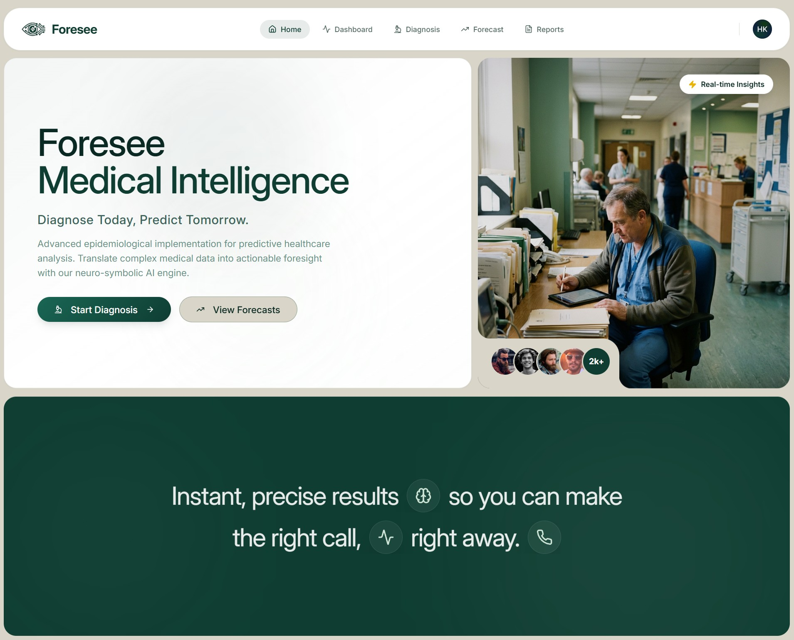
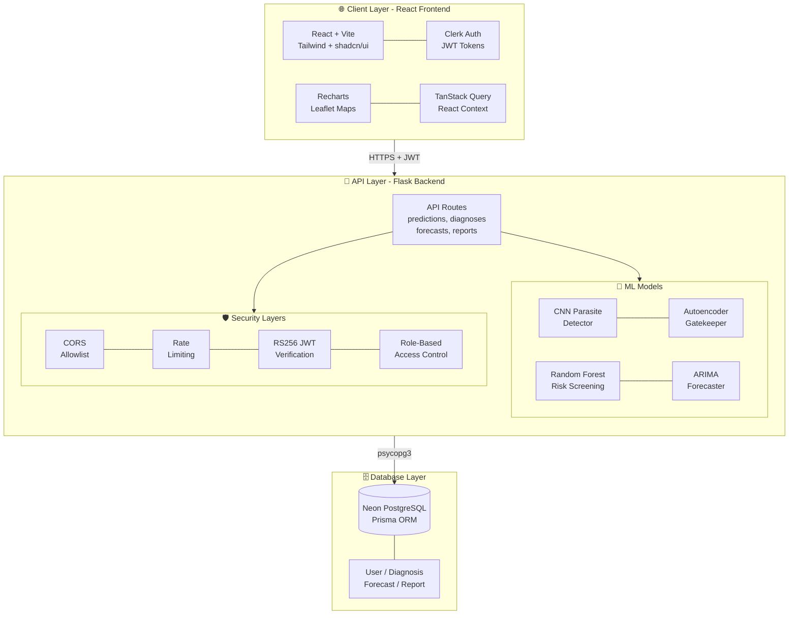
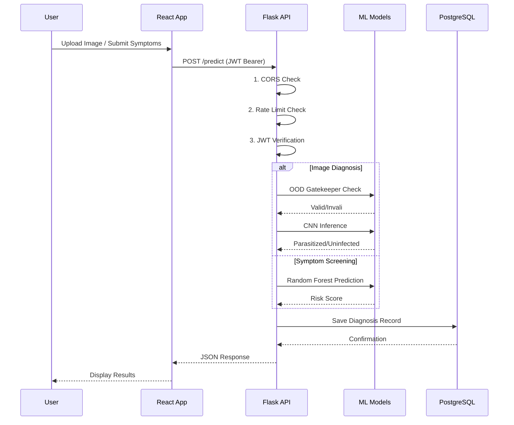
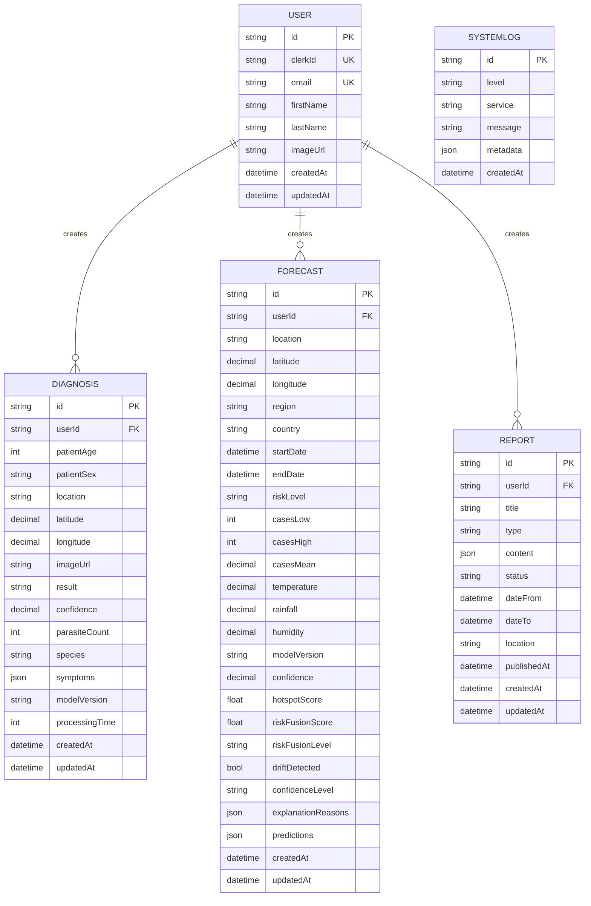
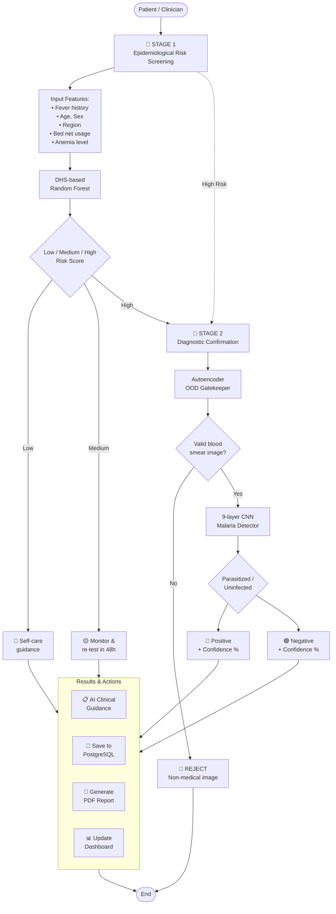

<div align="center">

# 🔬 FORESEE

## AI-Powered Malaria Diagnosis & Outbreak Forecasting Platform

[](https://www.python.org/)
[](https://reactjs.org/)
[](https://www.typescriptlang.org/)
[](https://tensorflow.org/)
[](https://flask.palletsprojects.com/)
[](https://neon.tech/)
[](https://docker.com/)

[](https://github.com/HumayunK01/CodeRedProject/actions)
[](LICENSE)
[](https://github.com/HumayunK01/CodeRedProject/commits)

---

> 🏥 **BE Final Year Major Project** | *"Diagnose Today. Predict Tomorrow."*

[🚀 Quick Start](#-quick-start) • [📱 Screenshots](#-screenshots) • [🧠 ML Models](#-machine-learning-models) • [🏗️ Architecture](#-architecture) • [🔧 Tech Stack](#-tech-stack)

---

</div>

## 🎯 Why Foresee?

**Foresee** is a comprehensive AI/ML platform designed to revolutionize malaria diagnostics and outbreak prediction in endemic regions. By combining deep learning microscopy analysis with epidemiological risk modeling, we aim to bridge the gap where skilled healthcare professionals are scarce.

### ✨ Key Capabilities

| 🔬 Diagnosis | 📈 Forecasting | 🛡️ Safety | 📊 Analytics |
|:---:|:---:|:---:|:---:|
| 94.85% CNN Accuracy | ARIMA Time-Series | OOD Image Filtering | Real-time Dashboards |
| 27,558 NIH Images | 1-4 Week Predictions | 7-Layer Security | Interactive Maps |
| DHS Risk Screening | Hotspot Detection | RBAC Access Control | PDF Reports |

---

## 📈 Project Stats

<div align="center">

[](https://github.com/HumayunK01/CodeRedProject)
[](https://github.com/HumayunK01/CodeRedProject)
[](https://github.com/HumayunK01/CodeRedProject)
[](https://github.com/HumayunK01/CodeRedProject/graphs/contributors)

| TypeScript | Python | CSS | Other |
|:----------:|:------:|:---:|:-----:|
| ~45% | ~40% | ~10% | ~5% |

</div>

---

## 📸 Platform Screenshots

<div align="center">

| Landing Page | Responsive Website | Mobile First Design |
|:---:|:---:|:---:|
|  |  | .jpg) |

</div>

---

## 🧠 Machine Learning Models

### 1. 🔬 CNN Parasite Detector
```
malaria_cnn_full.h5 · TensorFlow 2.15 · 27,558 images
```
| Metric | Score |
|:---|:---:|
| **Accuracy** | 94.85% |
| **Precision** | 95.6% |
| **Recall** | 94.0% |
| **F1-Score** | 94.8% |

### 2. 🏥 DHS Risk Index Calculator
```
malaria_symptoms_dhs.pkl · Random Forest
```
Epidemiological risk screening using DHS survey methodology with features like fever history, age, residence type, and anemia levels.

### 3. 🚫 Gatekeeper Autoencoder
```
gatekeeper_autoencoder.h5 · Convolutional Autoencoder
```
Out-of-distribution detection to reject invalid/non-medical images before CNN analysis.

### 4. 📈 ARIMA Outbreak Forecaster
```
outbreak_forecaster.pkl · statsmodels
```
Seasonal time-series forecasting for regional case predictions with 95% confidence intervals.

### 5. 🎯 Adaptive Ensemble Forecaster
```
adaptive_ensemble.pkl · Gradient Boosting + Weather/News Signals
```
Advanced ensemble model combining multiple base learners with live weather data and news sentiment analysis for improved outbreak prediction accuracy.

---

## 🏗️ System Architecture


```mermaid
flowchart TB
    subgraph Client["🌐 Client Layer - React Frontend"]
        direction LR
        Web[React + Vite<br/>Tailwind + shadcn/ui] --- Auth[Clerk Auth<br/>JWT Tokens]
        UI[Recharts<br/>Leaflet Maps] --- State[TanStack Query<br/>React Context]
    end

    subgraph API["🔮 API Layer - Flask Backend"]
        direction TB
        
        subgraph ML["🤖 ML Models"]
            CNN[CNN Parasite<br/>Detector] --- AE[Autoencoder<br/>Gatekeeper]
            RF[Random Forest<br/>Risk Screening] --- ARIMA[ARIMA<br/>Forecaster]
        end
        
        subgraph Security["🛡️ Security Layers"]
            CORS[CORS<br/>Allowlist] --- RL[Rate<br/>Limiting]
            RL --- JWT[RS256 JWT<br/>Verification]
            JWT --- RBAC[Role-Based<br/>Access Control]
        end
        
        Routes[API Routes<br/>predictions, diagnoses<br/>forecasts, reports]
    end

    subgraph DB["🗄️ Database Layer"]
        PG[(Neon PostgreSQL<br/>Prisma ORM)]
        Tables[User / Diagnosis<br/>Forecast / Report]
    end

    Client -- HTTPS + JWT --> API
    Routes --> ML
    Routes --> Security
    API -- psycopg3 --> PG
    PG --- Tables
```

### Request Flow


```mermaid
sequenceDiagram
    participant User
    participant Web as React App
    participant API as Flask API
    participant ML as ML Models
    participant DB as PostgreSQL

    User->>Web: Upload Image / Submit Symptoms
    Web->>API: POST /predict (JWT Bearer)
    
    API->>API: 1. CORS Check
    API->>API: 2. Rate Limit Check
    API->>API: 3. JWT Verification
    
    alt Image Diagnosis
        API->>ML: OOD Gatekeeper Check
        ML-->>API: Valid/Invali
        API->>ML: CNN Inference
        ML-->>API: Parasitized/Uninfected
    else Symptom Screening
        API->>ML: Random Forest Prediction
        ML-->>API: Risk Score
    end
    
    API->>DB: Save Diagnosis Record
    DB-->>API: Confirmation
    API-->>Web: JSON Response
    Web-->>User: Display Results
```

### Database Schema


```mermaid
erDiagram
    USER {
        string id PK
        string clerkId UK
        string email UK
        string firstName
        string lastName
        string imageUrl
        datetime createdAt
        datetime updatedAt
    }

    DIAGNOSIS {
        string id PK
        string userId FK
        int patientAge
        string patientSex
        string location
        decimal latitude
        decimal longitude
        string imageUrl
        string result
        decimal confidence
        int parasiteCount
        string species
        json symptoms
        string modelVersion
        int processingTime
        datetime createdAt
        datetime updatedAt
    }

    FORECAST {
        string id PK
        string userId FK
        string location
        decimal latitude
        decimal longitude
        string region
        string country
        datetime startDate
        datetime endDate
        string riskLevel
        int casesLow
        int casesHigh
        decimal casesMean
        decimal temperature
        decimal rainfall
        decimal humidity
        string modelVersion
        decimal confidence
        float hotspotScore
        float riskFusionScore
        string riskFusionLevel
        bool driftDetected
        string confidenceLevel
        json explanationReasons
        json predictions
        datetime createdAt
        datetime updatedAt
    }

    REPORT {
        string id PK
        string userId FK
        string title
        string type
        json content
        string status
        datetime dateFrom
        datetime dateTo
        string location
        datetime publishedAt
        datetime createdAt
        datetime updatedAt
    }

    SYSTEMLOG {
        string id PK
        string level
        string service
        string message
        json metadata
        datetime createdAt
    }

    USER ||--o{ DIAGNOSIS : "creates"
    USER ||--o{ FORECAST : "creates"
    USER ||--o{ REPORT : "creates"
```

### Two-Stage Clinical Workflow


```mermaid
flowchart TD
    Start([Patient / Clinician]) --> Stage1["🔬 STAGE 1<br/>Epidemiological Risk Screening"]
    
    Stage1 --> Input1[Input Features:<br/>• Fever history<br/>• Age, Sex<br/>• Region<br/>• Bed net usage<br/>• Anemia level]
    
    Input1 --> Model1[DHS-based<br/>Random Forest]
    Model1 --> Risk{"Low / Medium / High<br/>Risk Score"}
    
    Risk -->|Low| Self["🔵 Self-care<br/>guidance"]
    Risk -->|Medium| Monitor["🟡 Monitor &<br/>re-test in 48h"]
    Risk -->|High| Stage2["🔴 STAGE 2<br/>Diagnostic Confirmation"]
    
    Stage2 --> Guard[Autoencoder<br/>OOD Gatekeeper]
    Guard --> Valid{"Valid blood<br/>smear image?"}
    
    Valid -->|No| Reject["🚫 REJECT<br/>Non-medical image"]
    Valid -->|Yes| CNN[9-layer CNN<br/>Malaria Detector]
    
    CNN --> Result{"Parasitized /<br/>Uninfected"}
    Result --> Paras["🔴 Positive<br/>+ Confidence %"]
    Result --> Uninf["🟢 Negative<br/>+ Confidence %"]
    
    Stage1 -.->|High Risk| Stage2
    
    subgraph Results[Results & Actions]
        Guidance["📋 AI Clinical<br/>Guidance"]
        Save["💾 Save to<br/>PostgreSQL"]
        PDF["📄 Generate<br/>PDF Report"]
        Dashboard["📊 Update<br/>Dashboard"]
    end
    
    Self --> Results
    Monitor --> Results
    Paras --> Results
    Uninf --> Results
    Reject --> End([End])
    
    Results --> End
```

---

## 🔧 Tech Stack

### Backend
| Technology | Purpose |
|:---|:---|
| Python 3.11 | Runtime |
| Flask 3.0 | Web Framework |
| TensorFlow 2.15 | Deep Learning |
| scikit-learn | ML Models |
| statsmodels | Time-Series |
| PostgreSQL | Database |

### Frontend
| Technology | Purpose |
|:---|:---|
| React 18 | UI Framework |
| TypeScript | Type Safety |
| Vite | Build Tool |
| Tailwind CSS | Styling |
| shadcn/ui | Components |
| Recharts | Visualizations |
| Clerk | Authentication |

### Database
| Technology | Purpose |
|:---|:---|
| Neon PostgreSQL | Serverless DB |
| Prisma | ORM & Migrations |

---

## 🚀 Quick Start

### Prerequisites
- Python 3.11+ | Node.js 18+ | PostgreSQL | Clerk Account

### Installation

```bash
# 1️⃣ Clone the repository
git clone https://github.com/HumayunK01/CodeRedProject.git
cd CodeRedProject

# 2️⃣ Setup Database
cd apps/database
npm install
cp .env.example .env  # Add your Neon DATABASE_URL
npm run generate
npm run migrate

# 3️⃣ Setup Inference API
cd ../inference
python -m venv .venv
.venv\Scripts\activate  # Linux/Mac: source .venv/bin/activate
pip install -r requirements.txt
cp .env.example .env  # Add DATABASE_URL, CLERK keys
python flask_app.py  # Runs on http://localhost:8000

# 4️⃣ Setup Web Frontend
cd ../web
npm install
cp .env.example .env.local  # Add VITE_INFER_BASE_URL, Clerk keys
npm run dev  # Runs on http://localhost:8080
```

### Docker Deployment

```bash
# Copy environment template
cp .env.docker.example .env.docker

# Build and start all services
docker compose --env-file .env.docker up --build -d
```

| Service | URL |
|:---|:---|
| 🌐 Web | http://localhost:8080 |
| 🔮 API | http://localhost:8000 |

---

## 📡 API Endpoints

### Health Check
```http
GET /health
```

### Image Diagnosis (Doctor/Admin)
```http
POST /predict/image
Content-Type: multipart/form-data
```

### Symptom Risk Screening
```http
POST /predict/symptoms
Content-Type: application/json

{
  "fever": 1,
  "age_months": 36,
  "sex": "Male",
  "state": "Maharashtra",
  "residence_type": "Rural"
}
```

### Outbreak Forecast
```http
POST /forecast/region
Content-Type: application/json

{
  "region": "Maharashtra",
  "horizon_weeks": 4
}
```

---

## 🔐 Security Features

| Layer | Protection |
|:---|:---|
| 1 | CORS Strict Allowlist |
| 2 | Rate Limiting (Redis/In-Memory) |
| 3 | RS256 JWT + JWKS Verification |
| 4 | 7-Step File Upload Validation |
| 5 | Schema-Driven Input Validation |
| 6 | Security Headers |
| 7 | Audit Logging |

### Role-Based Access
- **Patient** - Risk screening, view own records
- **Doctor** - + Image diagnosis access
- **Admin** - + User management, global stats

---

## 📁 Project Structure

```
FORESEE/
├── apps/
│   ├── web/                    # React Frontend
│   │   ├── src/
│   │   │   ├── components/    # UI Components
│   │   │   ├── pages/         # Route Pages
│   │   │   ├── hooks/         # Custom Hooks
│   │   │   └── lib/           # Utilities
│   │   └── package.json
│   │
│   ├── inference/             # Flask ML Backend
│   │   ├── flask_app.py       # Main Application
│   │   ├── routes/            # API Endpoints
│   │   ├── core/              # ML & Config
│   │   ├── models/            # Trained Models
│   │   ├── scripts/           # Training Scripts
│   │   └── data/              # Datasets
│   │
│   └── database/              # Prisma ORM
│       ├── prisma/
│       │   ├── schema.prisma  # DB Schema
│       │   └── migrations/
│       └── src/
│           └── services/      # CRUD Services
│
├── package.json               # Monorepo Config
└── README.md                  # This File
```

---

## ⚠️ Important Disclaimer

> 📋 **Foresee is NOT a certified medical device.** This platform is for research and educational purposes only. All outputs should be interpreted by qualified healthcare professionals. The developers assume no liability for clinical decisions made using this tool.

---

## 🙏 Acknowledgments

<div align="center">

### Data Sources & Partners

| [](https://lhncbc.nlm.nih.gov/LHC-downloads/downloads.html) | [](https://www.who.int/teams/global-malaria-programme) | [](https://dhsprogram.com/) |
|:---:|:---:|:---:|
| **27,558 annotated blood smear images** | **Epidemiological guidelines** | **Feature engineering reference** |

</div>

---

<div align="center">

## 🏆 Built with ❤️ for Global Health Equity

**BE Final Year Major Project** · *2026*

[](https://github.com/HumayunK01/CodeRedProject)
[](LICENSE)

</div>
