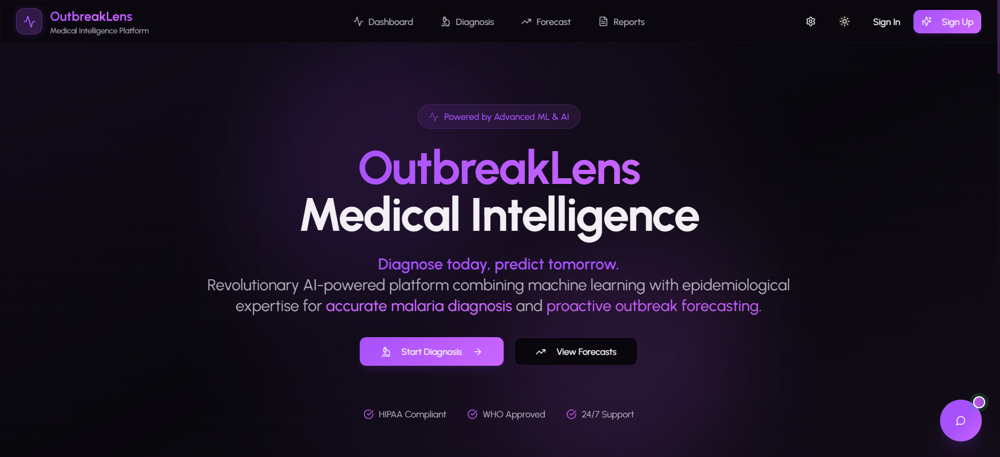

# 🧬 OutbreakLens

> **Diagnose Today, Predict Tomorrow** - AI-powered malaria diagnosis and outbreak forecasting platform

[](https://github.com/HumayunK01/CodeRedProject)
[](LICENSE)
[](#)

<div align="center">
  
</div>

---

## 🌟 What is OutbreakLens?

OutbreakLens is a comprehensive healthcare platform that combines cutting-edge machine learning with epidemiological expertise to revolutionize malaria detection and prevention. Built to serve healthcare professionals and endemic regions, it provides real-time diagnosis, outbreak predictions, and intelligent assistance.

### ✨ Key Features

🔬 **AI-Powered Diagnosis**
- Blood smear image analysis using CNN models
- Symptom-based risk assessment
- 94%+ diagnostic accuracy
- Sub-2-second inference time

📈 **Outbreak Forecasting**
- Regional malaria outbreak predictions
- ARIMA time-series modeling
- 4-week forecast horizon
- Interactive heat maps with hotspot detection

🤖 **Intelligent AI Assistant**
- OpenRouter-powered chatbot
- Real-time malaria guidance
- 24/7 medical support
- Context-aware responses

📍 **Location Intelligence**
- GPS-based risk assessment
- Geospatial outbreak tracking
- Region-specific insights
- Real-time location services

📄 **Professional Reporting**
- Medical-grade PDF reports
- HIPAA-compliant documentation
- Clinical interpretation
- Print-optimized design

📊 **Advanced Analytics**
- Real-time dashboard
- Interactive data visualizations
- System health monitoring
- Comprehensive metrics

---

## 🚀 Technology Stack

### Frontend
```
React 18 + TypeScript + Vite
├── Styling: Tailwind CSS + shadcn/ui
├── Animations: Framer Motion
├── Charts: Recharts
├── Maps: React Leaflet
├── Forms: React Hook Form + Zod
├── State: TanStack Query
└── PWA: Progressive Web App
```

### Backend
```
Flask + Python 3.9+
├── ML Models: CNN, Tabular, Time-series
├── Database: Prisma ORM + Neon PostgreSQL
├── API: RESTful architecture
└── Deployment: Railway/Render ready
```

### Machine Learning
```
Image Analysis: CNN (TensorFlow/Keras)
Symptoms: Risk assessment algorithms
Forecasting: ARIMA models
Chatbot: OpenRouter AI integration
```

---

## 📦 Project Structure

```
outbreaklens-monorepo/
├── apps/
│   ├── web/                    # Frontend (React + Vite)
│   │   ├── src/
│   │   │   ├── components/    # UI components
│   │   │   ├── pages/         # Route pages
│   │   │   ├── lib/           # Utilities & API
│   │   │   └── hooks/         # Custom hooks
│   │   └── public/            # Assets & PWA
│   └── inference/             # Backend (Flask API)
│       ├── src/main.py        # ML endpoints
│       └── requirements.txt   # Dependencies
├── database/
│   └── prisma/
│       └── schema.prisma      # Database schema
└── docs/                      # Documentation
```

---

## ⚡ Quick Start

### Prerequisites
- Node.js 18+
- Python 3.9+
- PostgreSQL (Neon)

### Installation

```bash
# Clone repository
git clone https://github.com/HumayunK01/CodeRedProject.git
cd outbreaklens-monorepo

# Install frontend dependencies
npm install

# Install backend dependencies
cd apps/inference
pip install -r requirements.txt
cd ../..

# Configure environment
cp apps/web/.env.example apps/web/.env.local
# Add your API keys and database URL

# Ensure ML models are present in apps/inference/models/
# Models are not included in the repository due to size constraints
# Contact the team to obtain the pre-trained models
```

### Start Development Servers

```bash
# Terminal 1: Start the frontend
npm run dev

# Terminal 2: Start the backend (Flask)
cd apps/inference
python flask_app.py
```

Visit `http://localhost:8080` for the frontend and `http://localhost:8000` for the backend API 🎉

### Environment Variables

```env
# Backend API
VITE_INFER_BASE_URL=http://localhost:8000

# AI Chatbot
VITE_OPENROUTER_API_KEY=your_key_here

# Database
DATABASE_URL=your_neon_connection_string
```

---

## 🎯 Core Features

### 1. **Dual-Mode Diagnosis**
- **Image Analysis**: Upload blood smear images for CNN-based malaria detection
- **Symptom Assessment**: Complete symptom checklist with intelligent risk scoring

### 2. **Regional Forecasting**
- Select any region for outbreak predictions
- View 4-week forecast with confidence intervals
- Identify outbreak hotspots on interactive maps

### 3. **AI Medical Assistant**
- Ask questions about malaria symptoms and prevention
- Get real-time medical guidance
- Context-aware responses powered by OpenRouter

### 4. **Professional Reports**
- Generate medical-grade PDF reports
- Include patient data, symptoms, and results
- Clinical interpretations and recommendations
- Suitable for healthcare documentation

### 5. **Real-Time Analytics**
- System health monitoring
- Live statistics and metrics
- Performance tracking
- Usage analytics dashboard

---

## 📊 System Performance

| Metric | Performance |
|--------|------------|
| **Diagnostic Accuracy** | 94%+ |
| **Inference Time** | < 2 seconds |
| **Forecast Accuracy** | 80%+ (4-week horizon) |
| **System Uptime** | 99.5%+ |
| **Lighthouse Score** | 95+ |
| **Bundle Size** | < 500KB gzipped |

---

## 🔌 API Reference

### Diagnosis Endpoints

```typescript
POST /api/predict/image
Body: FormData with image file
Response: { label, confidence, probability, explanations }

POST /api/predict/symptoms
Body: { fever, chills, headache, age, region, ... }
Response: { label, confidence, probability, threshold }
```

### Forecasting Endpoints

```typescript
POST /api/forecast/region
Body: { region, horizon_weeks }
Response: { region, predictions, hotspot_score, hotspots }
```

### Health Check

```typescript
GET /api/health
Response: { status, message, timestamp }
```

---

## 🚢 Deployment

### Frontend (Vercel)
```bash
cd apps/web
vercel
```

### Backend (Railway)
```bash
cd apps/inference
railway up
```

### Local Development (Both Services)
```bash
# Terminal 1: Start the frontend
npm run dev

# Terminal 2: Start the backend
cd apps/inference
python flask_app.py
```

### Docker (Full Stack)
```bash
docker-compose up -d
```

---

## 👥 Team

<table>
  <tr>
    <td align="center">
      <strong>Khan Humayun Majid</strong><br>
      <em>ML Engineering & Backend</em><br>
      Model development, API architecture
    </td>
    <td align="center">
      <strong>Ansari Zoha</strong><br>
      <em>Frontend & UI/UX</em><br>
      React development, design system
    </td>
    <td align="center">
      <strong>Ansari Adnan</strong><br>
      <em>Data Science</em><br>
      Dataset curation, validation
    </td>
  </tr>
</table>

---

## 📄 Documentation

- **[API Documentation](docs/api.md)** - Complete API reference
- **[Chatbot Setup](CHATBOT_SETUP.md)** - Configure AI assistant
- **[User Guide](docs/user-guide.md)** - Application usage
- **[Contributing](CONTRIBUTING.md)** - Development guidelines

---

## 🔒 Security & Compliance

- **Data Privacy**: No PHI stored without consent
- **HTTPS**: Enforced secure communication
- **Input Validation**: Client & server-side validation
- **HIPAA Ready**: Compliant architecture
- **Audit Logging**: Comprehensive tracking

---

## 📝 License

This project is licensed under the MIT License - see the [LICENSE](LICENSE) file for details.

### ⚠️ Medical Disclaimer

OutbreakLens is a decision support tool and **NOT a substitute for professional medical diagnosis**. All results must be interpreted by qualified healthcare providers. Always consult medical professionals for diagnosis and treatment decisions.

---

## 🆘 Support

- **Bug Reports**: [GitHub Issues](https://github.com/HumayunK01/CodeRedProject/issues)
- **Feature Requests**: [GitHub Discussions](https://github.com/HumayunK01/CodeRedProject/discussions)
- **Email**: humayunk.pvt@gmail.com
- **LinkedIn**: [devhumayun](https://www.linkedin.com/in/devhumayun/)

---

## 🔗 Links

- [🏠 Live Demo](https://outbreaklens.dev)
- [📖 Documentation](https://docs.outbreaklens.dev)
- [🐙 GitHub Repository](https://github.com/HumayunK01/CodeRedProject)

---

<div align="center">

**Built with ❤️ by the OutbreakLens Team**

*Transforming healthcare through AI*

[⭐ Star us on GitHub](https://github.com/HumayunK01/CodeRedProject) | [🐦 Follow updates](https://twitter.com/outbreaklens) | [💼 Connect](https://linkedin.com/in/devhumayun)

</div>